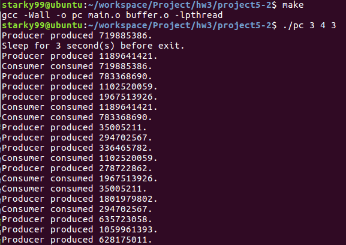

# Project5 Producer-Consumer Problem

## Question

> In this project, you will design a programming solution to the bounded-buffer problem using the producer and consumer processes shown in Figures 5.9 and 5.10. The solution presented in ection 7.1.1 uses three semaphores: empty and full, which count the number of empty and full slots in the buffer, and mutex, which is a binary (or mutualexclusion) semaphore that protects the actual insertion or removal of items in the buffer. For this project, you will use standard counting semaphores for empty and full and a mutex lock, rather than a binary semaphore, to represent mutex. The producer and consumer—running as separate threads —will move items to and from a buffer that is synchronized with the empty, full, and mutex structures. You can solve this problem using either Pthreads or the Windows API.

## Answer

这个项目是没有提供的文件的，所以我依照着前一个`Project`作为样板，实现了这个项目。

实现的文件及功能如下：

- `buffer.h` `buffer`的头文件，定义常量的值，定义`buffer` 中元素的种类 `buffer_item`，函数等。
- `buffer.c` `buffer`的实现文件：具体函数的实现。
- `main.c` `Project`的入口，进行函数的调用和整体的操作。
- `Makefile ` 编译文件。

### buffer.c

按照代码的顺序，首先初始化变量、锁和信号量。

buffer我们定义的是一个循环列表。

```c
//the buffer
buffer_item buffer[BUFFER_SIZE + 1];
size_t buffer_head, buffer_tail;

//mutex and semaphore
sem_t full, empty;
pthread_mutex_t lock;
```

`insert_item(buffer_item item)`向buffer中插入元素：

首先利用`sem_wait(&empty);`判断`buffer`是不是满的；`pthread_mutex_lock(&lock);`，锁保证我们对`buffer`操作的唯一性；接着对`buffer`进行插入操作；解除锁，并且增加`buffer`中的元素个数。

```c
int insert_item(buffer_item item) {
    sem_wait(&empty);
    pthread_mutex_lock(&lock);
    buffer[buffer_tail] = item;
    buffer_tail = (buffer_tail + 1) % (BUFFER_SIZE + 1);
    pthread_mutex_unlock(&lock);
    sem_post(&full);
    return 0;
}
```

`remove_item(buffer_item *item)`移除buffer中的元素。

首先利用`sem_wait(&full);`判断`buffer`是不是空的；`pthread_mutex_lock(&lock);`，锁保证我们对`buffer`操作的唯一性；接着对`buffer`进行移除操作；解除锁，并且减少`buffer`中的元素个数。

```c
int remove_item(buffer_item *item) {
    sem_wait(&full);
    pthread_mutex_lock(&lock);
    *item = buffer[buffer_head];
    buffer_head = (buffer_head + 1) % (BUFFER_SIZE + 1);
    pthread_mutex_unlock(&lock);
    sem_wait(&empty);
    return 0;
}
```

`*producer(void *param) `生产者函数：

每间隔随机的时间（上限是`MAX_SLEEP_TIME`）就生产（插入元素），并且播报生产的信息。

```c
void *producer(void *param) {
    buffer_item item;
    while (1) {
        sleep(rand() % MAX_SLEEP_TIME);
        item = rand();
        insert_item(item);
        printf("Producer produced %d.\n", item);
    }
}
```

`*consumer(void *param)` 消费者函数：

每间隔随机的时间（上限是`MAX_SLEEP_TIME`）就移除（移除元素），并且播报消费的信息。

```c
void *consumer(void *param) {
    buffer_item item;
    while (1) {
        sleep(rand() % MAX_SLEEP_TIME);
        remove_item(&item);
        printf("Consumer consumed %d.\n", item);
    }
}
```

`init_buffer()`初始化`buffer`，`destroy_buffer()`销毁`buffer`：

这两个函数的操作与前面一个`Project`类似，进行初始化 / 销毁的操作。

```c
void init_buffer() {
    pthread_mutex_init(&lock, NULL);
    sem_init(&full, 0, 0);
    sem_init(&empty, 0, BUFFER_SIZE);
    buffer_head = buffer_tail = 0;
}

void destroy_buffer() {
    pthread_mutex_destroy(&lock);
    sem_destroy(&full);
    sem_destroy(&empty);
}
```

### main.c

清晰的步骤执行操作。

/* 1 Get parameters on the command line*/

```c
if (argc != 4) {
    fprintf(stderr, "<Input> SleepSecond numProducer numConsumer\n");
    return 0;
}
int SleepSecond = atoi(argv[1]);
size_t numProducer = atoi(argv[2]), numConsumer = atoi(argv[3]);
```

/* 2 Initialize buffer*/

```c
init_buffer();
```

/* 3 Create producer threads*/

```c
pthread_t *producers = malloc(numProducer * sizeof(pthread_t));
for (int i = 0; i < numProducer; i++) {
    pthread_create(&producers[i], NULL, producer, NULL);
}
```

/* 4 Create consumer therads*/

```c
pthread_t *consumers = malloc(numConsumer * sizeof(pthread_t));
for (int i = 0; i < numConsumer; i++) {
    pthread_create(&consumers[i], NULL, consumer, NULL);
}
```

/* 5 Sleep*/

```c
printf("Sleep for %d second(s) before exit.\n", SleepSecond);
sleep(SleepSecond);
```

/* 6 Exit*/

```c
for (int i = 0; i < numProducer; i++) {
    pthread_cancel(producers[i]);
    pthread_join(producers[i], NULL);
}
sleep(3);   // time for consumers to consume the left items
for (int i = 0; i < numConsumer; i++) {
    pthread_cancel(consumers[i]);
    pthread_join(consumers[i], NULL);
}

free(producers);
free(consumers);
destroy_buffer();
```

### Makefile

```makefile
# makefile for thread pool

CC=gcc
CFLAGS=-Wall
PTHREADS=-lpthread

all: main.o buffer.o
	$(CC) $(CFLAGS) -o pc main.o buffer.o $(PTHREADS)

main.o: main.c
	$(CC) $(CFLAGS) -c main.c $(PTHREADS)

buffer.o: buffer.c buffer.h
	$(CC) $(CFLAGS) -c buffer.c $(PTHREADS)

clean:
	rm -rf *.o
	rm -rf pc
```


## 结果展示

程序需要在命令行中调用时输入睡眠时间、生产者、消费者的数目，运行结果如下：

